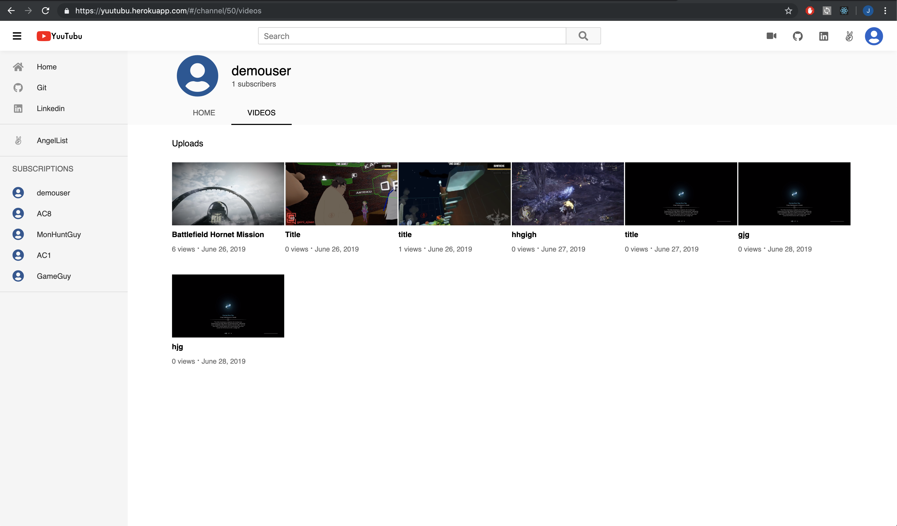

# Yuutubu
* Yuutubu is an app built in the likeness of Youtube, a website for users to stream videos, and/or upload videos to.

* To all future a/A students, do not use this as a metric for how your fullstack should look like; the effort put into this extends beyond the initial 10 days, with techs, and features that you would otherwise have to research on your own to know how they work.

* [Link to Yuutubu]{https://yuutubu.herokuapp.com/}

# Technologies
* Yuutubu is build using Ruby on Rails and PostgreSQL for the backend, while React JS / Redux is used on the front end.
* Video data are hosted on Amazon Webservices (AWS)

# Features

## Authentication
* Users can sign up and/or login to Youtubu to access some features that are only available to logged in users.

  
## Channel
* Every User has a Channel upon signing up.
* Every users can view each other's channel pages
* Channel pages is into two sub tabs, home and video
* Home tab always has a single video on display, if the channel owner has one.
* Video tab shows all the videos own by the channel owner

## Video Thumbnails
* All video thumbnails have video preview feature
* If a user hover their mouse over a thumbnail briefly, a preview plays.

## Videos
* All users can watch videos 
* Logged in users can upload their own videos
* Video player on the main video pages has a custom built progress bar, and UI

## Video Mini-player
* Available as one of the clickables in the custom UI of the video player
* Users can toggle a video mini-player, which allows the user to watch a video while searching for other videos
* Double clicking on the screen of the mini-player brings the user can to the original video page

## Comments
 * Users can post comments on videos 
 * Users who own comments can delete their comments

 
## Likes / Dislikes
* Users can like / dislike videos by clicking on a thumbs up or a thumbs down
* If a video is liked, clicking on the like again unlikes the video, and vice versa.

## Searching
* User can search for videos using the search bar.
* Search results are based off title matching, and video description matching
* Everytime a user has typed something, the search bar has a drop down that shows titles of videos that matched what has been typed so far.
* Everytime a user searches for something, the particular phrase, that was searched, is saved to a user's search history, and will appear everytime a user selects the search bar, either when the search bar is empty, or contains a phrase similiar to what was previously searched.

